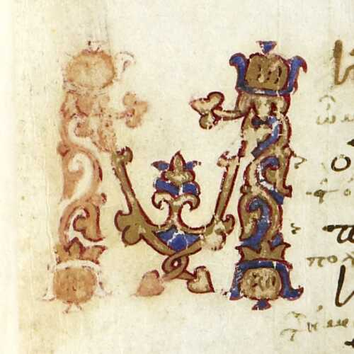

---

---

# Same & Different

“identical” & “different”

“identity” & “difference”

---

**Identity** and **difference** depend on context.

---

## ¼ + ½

---

## ½ + ¼

---

## ¾

---

You have an intuitive understanding of “Scholarly Identity”.

---

## ½ + ¼ = ¾

---

And you know that it is *functionally determined*, and that this depends on *technology*…

---

## 1/2 + 1/4

---

## 2/4 + 1/4

---

## 0.25 + 0.5

---

## 0.01 + 0.10

---

Let’s level up. We are not only computerers but Humanists…

---

“a quarter and a half”

---

“a half and a quarter”

---

~~~
˘  ￣   ˘  ￣  ˘ ￣
a quarter and a half

(iambic trimeter)
~~~

---

~~~
˘  ￣   ˘   ˘ ￣   ￣
a half and a quarter

( an iamb, a phyrric, and a spondee? 

or an amphibrach and a baccius?)
~~~

---

## The Same or Different?

- “the son of Atreus, spear-loving Menelaos”

- “Menelaos, son of Atreus”

---

## The Same or Different?

“In 1815, M. Charles-François-Bienvenu Myriel was Bishop of D—— He was an old man of about seventy-five years of age; he had occupied the see of D—— since 806.”

“En 1815, M. Charles-François-Bienvenu Myriel était évêque de Digne. C'était un vieillard d'environ soixante-quinze ans; il occupait le siège de Digne depuis 1806.”

---

## The Same or Different?

- “…what role will you play? Will you coordinate?”

- “…what rôle will you play? Will you coördinate?”

---

## Use this template!

Build a presentation with:

`pandoc -t revealjs markdown.md -s -o identity.html --metadata pagetitle=identity`

The result will be `identity.html`.

